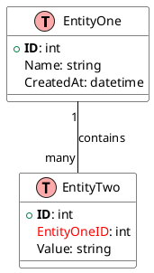
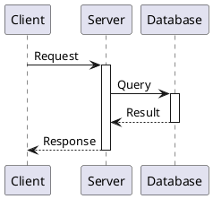
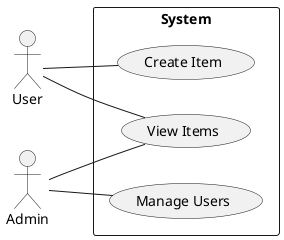

# Agent Guide: Adding New Patterns to PlantUML Ent Kit

This guide helps AI agents and automated systems add new architecture patterns and entity models to this repository.

## Quick Start for Agents

### Step 1: Create the PlantUML File

Create a `.puml` file in `catalogue/reference-architectures/uml/`:

```bash
catalogue/reference-architectures/uml/<pattern-name>.puml
```

### Step 2: Create the Documentation

Create a matching `.md` file in `catalogue/reference-architectures/`:

```bash
catalogue/reference-architectures/<pattern-name>.md
```

### Step 3: Use PlantUML Proxy for Images

In your documentation, use the PlantUML proxy URL to render diagrams instantly:

```markdown

```

This renders the diagram on-the-fly from the source file - no need to wait for GitHub Actions!

### Step 4: Commit and Push

GitHub Actions will also:
1. Detect the new `.puml` file
2. Render it to PNG in `catalogue/reference-architectures/images/`
3. Commit the rendered image back to the repo (as backup)

## Directory Structure

```
catalogue/reference-architectures/
├── uml/                    # PlantUML source files (.puml, .pu)
│   ├── crm.puml
│   ├── ecomm.puml
│   └── <your-pattern>.puml
├── images/                 # Auto-generated PNG renders
│   ├── crm.png
│   ├── ecomm.png
│   └── <your-pattern>.png  # Will be auto-generated
├── crm.md                  # Documentation files
├── ecomm.md
└── <your-pattern>.md
```

## PlantUML Templates

### Template 1: Entity-Relationship Model (for database schemas)



### Template 2: Component Architecture (for system design)

```plantuml
@startuml

skinparam component {
    BackgroundColor #E8F4FD
    BorderColor #1976D2
}

!define component(x) component x << (C,#FFAAAA) >>

component(ComponentA) {
    Description of what
    this component does
}

component(ComponentB) {
    Another component
    description here
}

database DataStore {
    Stores persistent data
}

queue MessageQueue {
    Async message handling
}

ComponentA -> ComponentB : "action"
ComponentB -> DataStore : "read/write"
ComponentA --> MessageQueue : "publish"

@enduml
```

### Template 3: Sequence Diagram (for interactions)



### Template 4: Use Case Diagram



## Documentation Template

Use this template for the `.md` file:

```markdown
# Pattern Name

Brief description of what this pattern represents and when to use it.

## Overview


## Components

### Component 1
- **Purpose**: What it does
- **Key Features**: Main capabilities

### Component 2
- **Purpose**: What it does
- **Key Features**: Main capabilities

## Relationships

| From | To | Relationship |
|------|----|--------------|
| Component1 | Component2 | Description |

## When to Use

- Scenario 1
- Scenario 2

## PlantUML Source

\`\`\`plantuml
@startuml
' Paste the PlantUML code here for reference
@enduml
\`\`\`
```

## File Naming Conventions

| Type | Pattern | Example |
|------|---------|---------|
| PlantUML | `<name>.puml` or `<name>.pu` | `llm-tool-call.puml` |
| Documentation | `<name>.md` | `llm-tool-call.md` |
| Image | `<name>.png` (auto-generated) | `llm-tool-call.png` |

Use kebab-case for file names: `my-pattern-name.puml`

## Supported File Extensions

The GitHub Actions workflow renders files with these extensions:
- `.puml` (preferred)
- `.pu`
- `.plantuml`

## Common Patterns in This Repository

| Pattern | Type | Use Case |
|---------|------|----------|
| CRM | Entity Model | Customer relationship management |
| E-Commerce | Entity Model | Online shopping systems |
| LMS | Entity Model | Learning management |
| CMS | Entity Model | Content management |
| HMS | Entity Model | Hospital management |
| Agentic RAG | Component | AI retrieval-augmented generation |
| LLM Tool Call | Sequence | LLM tool/function calling |

## Validation Checklist

Before committing, ensure:

- [ ] PlantUML file is in `catalogue/reference-architectures/uml/`
- [ ] File starts with `@startuml` and ends with `@enduml`
- [ ] Documentation `.md` file references the correct image path
- [ ] Image path in docs uses: `images/<filename>.png`
- [ ] No syntax errors in PlantUML (test locally if possible)

## Testing Locally (Optional)

If you have PlantUML installed locally:

```bash
# Render a single file
java -jar plantuml.jar -tpng catalogue/reference-architectures/uml/my-pattern.puml

# Or use VS Code with PlantUML extension
```

## Triggering GitHub Actions

The workflow triggers automatically when you push files with `.puml`, `.pu`, or `.plantuml` extensions. You can also:

1. Go to Actions tab in GitHub
2. Select "Render PlantUML Diagrams"
3. Click "Run workflow"
