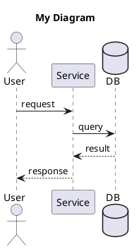
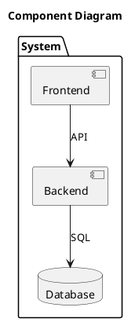

# Pattern Diagrams - Agent Instructions

This repository contains architecture patterns, data models, and research paper diagrams in PlantUML format.

## Quick Start for Agents

### 1. Find a Pattern
```bash
# Search patterns.json for relevant patterns
cat patterns.json | jq '.patterns[] | select(.keywords[] | contains("YOUR_KEYWORD"))'
```

### 2. Use a Pattern
1. Read the `.puml` file from the `file` path in patterns.json
2. Copy and modify for your use case
3. Render using the local Kroki server or PlantUML proxy

### 3. Render a Diagram
```bash
# If self-hosted Kroki is running:
curl -X POST http://localhost:8000/plantuml/svg -d '@startuml
A -> B: message
@enduml'

# Or use PlantUML public proxy (for existing files):
# http://www.plantuml.com/plantuml/proxy?src=https://raw.githubusercontent.com/OWNER/REPO/main/path/to/file.puml
```

## Repository Structure

```
├── patterns.json              # Machine-readable pattern index (START HERE)
├── catalogue/
│   ├── reference-architectures/
│   │   ├── uml/              # PlantUML source files
│   │   └── *.md              # Documentation
│   ├── research-papers/
│   │   ├── uml/              # Research paper diagrams
│   │   └── *.md              # Paper summaries
│   └── data-models/          # ERD diagrams (coming soon)
├── infrastructure/           # Self-hosting setup
│   ├── docker-compose.yml    # Kroki + site deployment
│   └── site/                 # Astro static site
└── scripts/
    └── validate-puml.sh      # Syntax validation
```

## Pattern Categories

| Category | Description | Example Patterns |
|----------|-------------|------------------|
| `ai` | AI/LLM patterns | Tool Call, MCP, RAG, Context Management |
| `data` | Data models | CRM, LMS, E-commerce, HMS ERDs |
| `enterprise` | Business patterns | Use cases, workflows |
| `research` | Paper summaries | DeepSeek Engram |

## API Endpoints (When Self-Hosted)

```
GET  /api/patterns.json           # All patterns with metadata
GET  /api/patterns.json?q=auth    # Search patterns
GET  /api/patterns.json?category=ai  # Filter by category
POST /kroki/plantuml/svg          # Render PlantUML to SVG
POST /kroki/mermaid/svg           # Render Mermaid to SVG
POST /kroki/d2/svg                # Render D2 to SVG
```

## Adding New Patterns

1. Create PlantUML file in appropriate `uml/` directory
2. Add documentation `.md` file
3. Update `patterns.json` with metadata
4. Run `./scripts/validate-puml.sh` before committing
5. GitHub Actions will auto-render PNG images

## PlantUML Quick Reference





## Common Errors to Avoid

1. **Don't mix diagram types** - Use either `participant` OR `component`, not both
2. **Define actors before use** - `actor "User" as User` before `User -> Service`
3. **No text inside component()** - Use external notes instead
4. **Use ASCII in notes** - Avoid unicode bullets (•), use asterisks (*)
5. **Don't nest rectangles with notes inside** - Use `package` instead

## Self-Hosting

See `infrastructure/README.md` for deploying with:
- Docker Compose
- Kroki diagram server
- Tailscale Funnel (no public IP needed)
