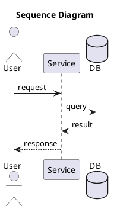

# Pattern Diagrams - Agent Instructions

Architecture patterns, data models, and research paper diagrams in PlantUML format.

## Quick Start

### 1. Find a Pattern
```bash
# Search the pattern index
cat patterns.json | jq '.patterns[] | select(.keywords[] | contains("YOUR_KEYWORD"))'

# Or browse categories
cat patterns.json | jq '.patterns[] | select(.category == "ai")'
```

### 2. Get Pattern Source
```bash
# Read the PlantUML source
cat catalogue/reference-architectures/uml/mcp-architecture.puml
```

### 3. Use Pre-Rendered Images
```
# PNG (cached via jsDelivr CDN)
https://cdn.jsdelivr.net/gh/keugenek/plantuml-ent-kit@main/catalogue/reference-architectures/images/mcp-architecture.png

# SVG
https://cdn.jsdelivr.net/gh/keugenek/plantuml-ent-kit@main/catalogue/reference-architectures/images/mcp-architecture.svg
```

## Pattern Categories

| Category | ID | Examples |
|----------|-----|----------|
| AI/LLM | `ai` | Tool Call, MCP, RAG, Context Management |
| Data Models | `data` | CRM, LMS, E-commerce ERDs |
| Enterprise | `enterprise` | Use cases, workflows |
| Research | `research` | DeepSeek Engram |

## patterns.json Schema

```json
{
  "patterns": [{
    "slug": "mcp-architecture",
    "name": "Model Context Protocol",
    "category": "ai",
    "description": "Standardized protocol for AI-tool integration",
    "file": "catalogue/reference-architectures/uml/mcp-architecture.puml",
    "images": {
      "png": "catalogue/reference-architectures/images/mcp-architecture.png",
      "svg": "catalogue/reference-architectures/images/mcp-architecture.svg"
    },
    "keywords": ["mcp", "claude", "tool integration"]
  }]
}
```

## Adding New Patterns

1. Create PlantUML file: `catalogue/*/uml/your-pattern.puml`
2. Add documentation: `catalogue/*/your-pattern.md`
3. Update `patterns.json` with metadata
4. Push - GitHub Actions auto-renders PNG/SVG

## PlantUML Quick Reference



## Common Errors to Avoid

1. **Don't mix diagram types** - Use either `participant` OR `component`, not both
2. **Define actors before use** - `actor "User" as User` before `User -> Service`
3. **No text inside component()** - Use external notes instead
4. **Use ASCII in notes** - Avoid unicode bullets, use asterisks (*)
