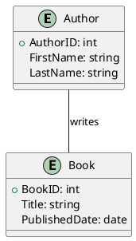
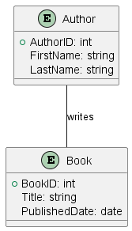
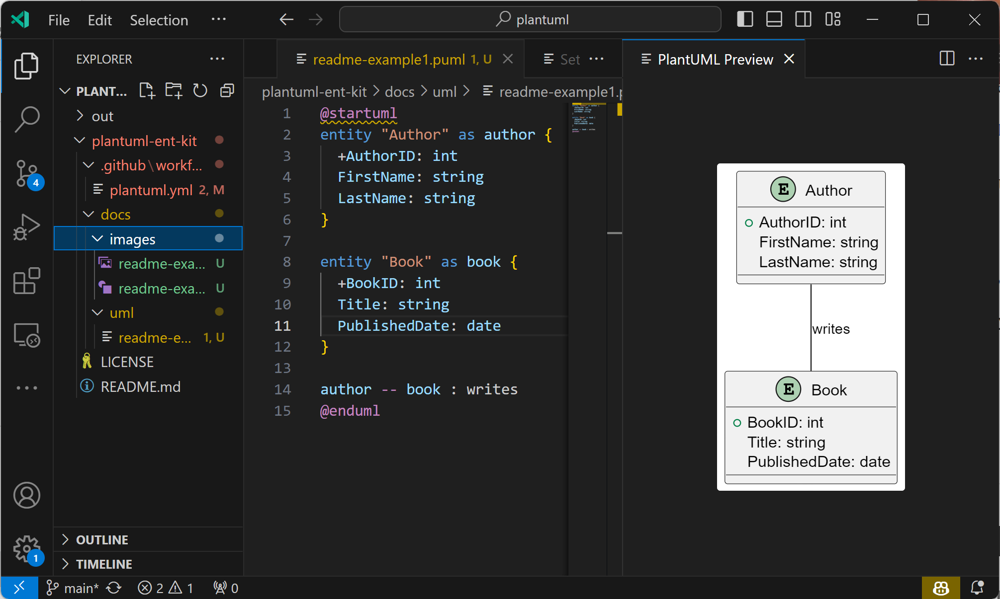

# Ent Kit: PlantUML-based Entity Modeling Toolkit with Reference Architecture Catalogue

Ent Kit provides a comprehensive guide and examples for utilizing PlantUML to create entity
models within Visual Studio Code (VS Code).
This repository serves as a starting point for analysts, developers, and data architects
to dive into entity modeling using an intuitive graphical notation provided by PlantUML.

## What is Entity Modeling?

Entity Modeling is a form of conceptual data modeling that visually represents the structure
and relationships of information within a domain. It's used to provide a clear understanding
of the entities, attributes, and relationships that exist within a system or domain,
facilitating better design, communication, and documentation.

Typical features of Entity Modeling tools include:
- Entity definition and relationship mapping.
- Attribute definition and data type specification.
- Graphical representation of entities and relationships.
- Validation of model consistency and integrity.
- Generation of database schemas or code from models.

## Reference Architecture Catalogue

Reference Architectures is well-known designs widely used in various companies that proved
themselves as a standard way of doing something.

[Catalogue](/catalogue/) contains a set of Reference Architectures described in PlantUML.

See following examples of Reference Entity Models:
* [Customer Relationship Management (CRM) System Reference Model](/catalogue/reference-models/crm.md)
* [E-Commerce System Model](/catalogue/reference-models/ecomm.md)
* [Learning Management System (LMS) Model](/catalogue/reference-models/lms.md)
* [Content Management System (CMS) Model](/catalogue/reference-models/cms.md)

## Designing an Entity Model using PlantUML

PlantUML provides a simple and intuitive textual notation for creating diagrams, including entity models. Here’s a basic example of an entity model representing a simple bookstore:

### In this example:

Two entities, Author and Book, are defined along with their attributes.

A relationship is established between Author and Book indicating that an author writes a book.

# Setting up Visual Studio Code for PlantUML and Entity Modeling

Now follow below steps to set up VS Code for PlantUML and Entity Modeling.

## Install Visual Studio Code:

Download and install Visual Studio Code from the official website: https://code.visualstudio.com/download

## Install PlantUML Extension:
Open VS Code, go to Extensions (you can use the shortcut Ctrl+Shift+X), search for PlantUML,
and click Install on the PlantUML extension by Jebbs.

## Install Graphviz (Optional):
To render diagrams, install Graphviz from the official website: https://graphviz.org/download/
After installation, ensure that the Graphviz bin directory is added to your system's PATH.

## Configure PlantUML Extension (if necessary):
Open the settings (File > Preferences > Settings), search for PlantUML, and configure any necessary
settings such as the PlantUML server or local render settings.

* Make sure to set up 'java' location if it is not in path folder.
* Configure output folder, default format, etc.

## Create a New PlantUML File:
Create a new file with a .puml extension, and start modeling your entities as shown in the example above.

## Viewing Your Diagrams:
To view your diagrams, right-click anywhere in the editor and select PlantUML: Preview Current Diagram.
Now, you are all set to start creating entity models using PlantUML in Visual Studio Code!

# Contributing
Feel free to contribute to this repository by submitting issues, improving the documentation, or submitting pull requests.

# License
This project is licensed under the MIT License.

# Contact
For any inquiries or feedback, please open an issue on this repository.
