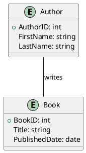

# PlantUML Ent Kit

> **Entity Modeling Toolkit + Reference Architecture Catalogue + Agentic CI/CD**

[](https://github.com/keugenek/plantuml-ent-kit/actions/workflows/pages.yml)
[](https://github.com/keugenek/plantuml-ent-kit/actions/workflows/plantuml.yml)

**Live Site:** [keugenek.github.io/plantuml-ent-kit](https://keugenek.github.io/plantuml-ent-kit/)

---

## 🚀 Quick Links

| Section | Description |
|---------|-------------|
| [Catalogue](catalogue/) | Reference architectures & patterns |
| [Git Flows](docs/git-flows.md) | Agentic CI/CD workflow documentation |
| [AGENTS.md](AGENTS.md) | Instructions for AI agents |
| [Skills](#skills) | Reusable agent skills |

---

## 🤖 Agentic Workflows

This repository demonstrates **fully agentic CI/CD**:

### Git Flow Tiers

| Flow | Automation | Best For |
|------|------------|----------|
| [Simplified GitFlow](docs/simplified-gitflow.md) | 20% | Small teams, learning git |
| [Agentic Team Flow](docs/agentic-team-flow.md) | 70% | Teams wanting oversight |
| [Full Agentic Flow](docs/agentic-git-flows.md) | 95% | Mature codebases |

### DORA Metrics (This Repo)

| Metric | Before | After |
|--------|--------|-------|
| Deploy Frequency | Weekly | Hourly |
| Lead Time | Days | Minutes |
| MTTR | Hours | Instant |

### Workflow Files

- [`.github/workflows/agentic-review.yml`](.github/workflows/agentic-review.yml) - AI code review on PRs
- [`.github/workflows/agentic-deploy.yml`](.github/workflows/agentic-deploy.yml) - Auto-deploy with self-healing
- [`.github/workflows/plantuml.yml`](.github/workflows/plantuml.yml) - Auto-render diagrams
- [`.github/workflows/pages.yml`](.github/workflows/pages.yml) - Deploy to GitHub Pages

---

## 📚 Reference Architecture Catalogue

### Entity Models

| Model | Description |
|-------|-------------|
| [CRM System](catalogue/reference-architectures/crm.md) | Customer Relationship Management |
| [E-Commerce](catalogue/reference-architectures/ecomm.md) | Online store architecture |
| [LMS](catalogue/reference-architectures/lms.md) | Learning Management System |
| [CMS](catalogue/reference-architectures/cms.md) | Content Management System |

### AI/LLM Patterns

| Pattern | Description |
|---------|-------------|
| [LLM Tool Call](catalogue/reference-architectures/llm-tool-call.md) | Function calling pattern |
| [Context Management](catalogue/reference-architectures/llm-context-management.md) | RAG, compaction, sliding windows |
| [MCP Architecture](catalogue/reference-architectures/mcp-architecture.md) | Model Context Protocol |
| [Skills Pattern](catalogue/reference-architectures/skills-pattern.md) | Modular agent capabilities |
| [Agent Orchestration](catalogue/reference-architectures/agent-orchestration.md) | Multi-agent coordination |
| [Tool Chaining](catalogue/reference-architectures/tool-chaining.md) | Sequential tool execution |
| [Agentic RAG](catalogue/reference-architectures/agentic-rag.md) | AI-driven retrieval |

### Git Flow Diagrams

| Diagram | PlantUML |
|---------|----------|
| [Flow Comparison](catalogue/flow-comparison.puml) | Traditional vs Agentic |
| [Flow Evolution](catalogue/flow-evolution.puml) | Three-tier progression |
| [DORA Comparison](catalogue/dora-comparison.puml) | Before/After metrics |
| [Paradigm Shifts](catalogue/paradigm-shifts.puml) | Processes, Tools, Teams |

---

## 🛠️ Skills

Reusable agent skills for common tasks:

### PlantUML Rendering

```yaml
# Trigger: Push .puml files
# Action: Auto-render to PNG, commit back
# Location: .github/workflows/plantuml.yml
```

### Agentic Code Review

```yaml
# Trigger: PR opened
# Action: Analyze diff, post review, auto-merge if eligible
# Location: .github/workflows/agentic-review.yml
```

### Self-Healing Deploy

```yaml
# Trigger: Push to main
# Action: Deploy, auto-rollback on failure, create incident
# Location: .github/workflows/agentic-deploy.yml
```

---

## 🏗️ Setup

### VS Code + PlantUML

1. Install [VS Code](https://code.visualstudio.com/)
2. Install [PlantUML extension](https://marketplace.visualstudio.com/items?itemName=jebbs.plantuml)
3. Install [Graphviz](https://graphviz.org/download/) (optional, for local rendering)

### For AI Agents

See [AGENTS.md](AGENTS.md) for:
- How to add new patterns
- Commit conventions
- Auto-rendering workflow

---

## 📖 PlantUML Quick Start




---

## 🔗 External Resources

- [PlantUML Official](https://plantuml.com/)
- [PlantUML Online Server](https://www.plantuml.com/plantuml/uml/)
- [DORA Metrics](https://dora.dev/)
- [GitHub Actions](https://docs.github.com/en/actions)

---

## 📝 Contributing

1. Fork the repo
2. Create a feature branch
3. Add your pattern/diagram
4. Open a PR (AI will review!)

---

## 📄 License

MIT License - see [LICENSE](LICENSE)

---

## 📬 Contact

Open an [issue](https://github.com/keugenek/plantuml-ent-kit/issues) for questions or feedback.
