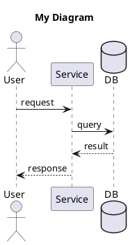

# Pattern Diagrams: Architecture Patterns & Data Models

A collection of architecture patterns, data models, and research paper diagrams in PlantUML format.

**Infrastructure & Tooling**: See [plantuml-ent-kit-infra](https://github.com/keugenek/plantuml-ent-kit-infra) for self-hosting, CI/CD workflows, and agent APIs.

## Quick Start

```bash
# Browse patterns
ls catalogue/reference-architectures/uml/

# View pre-rendered images (cached via jsDelivr CDN)
https://cdn.jsdelivr.net/gh/keugenek/plantuml-ent-kit@main/catalogue/reference-architectures/images/mcp-architecture.png
```

## Pattern Categories

### AI/LLM Patterns

| Pattern | Description |
|---------|-------------|
| [LLM Tool Call](catalogue/reference-architectures/llm-tool-call.md) | Function calling sequence |
| [LLM Context Management](catalogue/reference-architectures/llm-context-management.md) | Subagents, RAG, compaction, sliding windows |
| [Model Context Protocol (MCP)](catalogue/reference-architectures/mcp-architecture.md) | Anthropic's tool integration standard |
| [Skills Pattern](catalogue/reference-architectures/skills-pattern.md) | Composable agent capabilities |
| [Agent Orchestration](catalogue/reference-architectures/agent-orchestration.md) | Multi-agent coordination |
| [Tool Chaining](catalogue/reference-architectures/tool-chaining.md) | Sequential tool execution |
| [Agentic RAG](catalogue/reference-architectures/agentic-rag.md) | Retrieval-augmented generation |

### Data Models (ERD)

| Model | Description |
|-------|-------------|
| [CRM](catalogue/reference-architectures/crm.md) | Customer Relationship Management |
| [E-Commerce](catalogue/reference-architectures/ecomm.md) | Online store platform |
| [LMS](catalogue/reference-architectures/lms.md) | Learning Management System |
| [CMS](catalogue/reference-architectures/cms.md) | Content Management System |
| [HMS](catalogue/reference-architectures/hms.md) | Hospital Management System |

### Research Papers

| Paper | Description |
|-------|-------------|
| [DeepSeek Engram](catalogue/research-papers/deepseek-engram.md) | O(1) knowledge retrieval via n-gram hashing |

## Repository Structure

```
catalogue/
├── reference-architectures/
│   ├── uml/           # PlantUML source files
│   ├── images/        # Pre-rendered PNG/SVG (auto-generated)
│   └── *.md           # Documentation
├── research-papers/
│   ├── uml/
│   ├── images/
│   └── *.md
└── data-models/       # Coming soon
```

## Auto-Rendering

GitHub Actions automatically renders all PlantUML files to PNG/SVG on push:

1. Edit any `.puml` file
2. Push to any branch
3. Workflow renders and commits images
4. Images cached globally via jsDelivr CDN

## For AI Agents

This repo is designed for agentic workflows. Agents can:

1. **Find patterns**: Search `catalogue/*/uml/*.puml`
2. **Copy and modify**: Use existing patterns as templates
3. **Auto-render**: Push changes, GitHub Actions renders images

See [plantuml-ent-kit-infra](https://github.com/keugenek/plantuml-ent-kit-infra) for:
- Machine-readable `patterns.json` index
- Self-hosted diagram server
- Agent API documentation
- `CLAUDE.md` for agent discovery

## PlantUML Quick Reference



## Local Development

1. Install [VS Code PlantUML extension](https://marketplace.visualstudio.com/items?itemName=jebbs.plantuml)
2. Install [Graphviz](https://graphviz.org/download/)
3. Right-click in `.puml` file → Preview Current Diagram

## Contributing

1. Create PlantUML file in `catalogue/*/uml/`
2. Add documentation `.md` file
3. Push - GitHub Actions renders images automatically

## License

MIT
