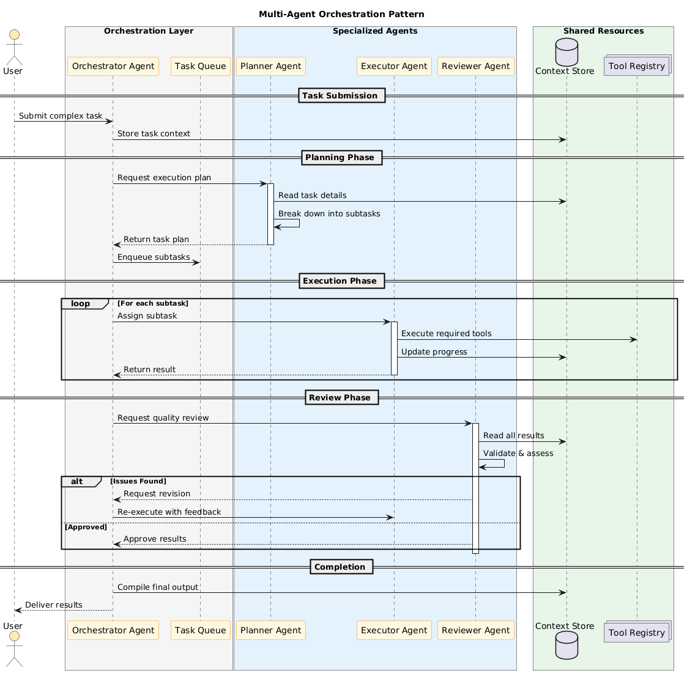

# Multi-Agent Orchestration Pattern

The Agent Orchestration pattern coordinates multiple specialized agents to collaboratively complete complex tasks that exceed the capabilities of a single agent.

## Overview



## Pattern Description

This pattern divides complex work among specialized agents:
- **Orchestrator**: Coordinates the overall workflow
- **Planner**: Breaks down tasks into subtasks
- **Executor**: Performs the actual work
- **Reviewer**: Validates quality and correctness

## Components

### Orchestrator Agent
- **Purpose**: Central coordinator for multi-agent workflows
- **Key Responsibilities**:
  - Task distribution
  - Progress monitoring
  - Result aggregation
  - Error handling and recovery

### Planner Agent
- **Purpose**: Strategic task decomposition
- **Key Responsibilities**:
  - Analyzing complex requests
  - Breaking down into subtasks
  - Identifying dependencies
  - Estimating requirements

### Executor Agent
- **Purpose**: Task execution
- **Key Responsibilities**:
  - Executing assigned subtasks
  - Using available tools
  - Reporting progress
  - Handling execution errors

### Reviewer Agent
- **Purpose**: Quality assurance
- **Key Responsibilities**:
  - Validating outputs
  - Checking for errors
  - Suggesting improvements
  - Approving or rejecting work

### Shared Resources

| Resource | Purpose |
|----------|---------|
| **Context Store** | Shared memory for task state |
| **Task Queue** | Ordered list of pending subtasks |
| **Tool Registry** | Available tools for agents |

## Orchestration Patterns

### Hierarchical
```
Orchestrator
    ├── Planner
    ├── Executor 1
    ├── Executor 2
    └── Reviewer
```

### Pipeline
```
Planner → Executor → Reviewer → Orchestrator
```

### Collaborative
```
Agent A ←→ Agent B ←→ Agent C
         ↓
    Orchestrator
```

## Communication Protocol

```json
{
  "message_type": "task_assignment",
  "from": "orchestrator",
  "to": "executor_1",
  "payload": {
    "task_id": "task_123",
    "description": "Implement user authentication",
    "context": { "relevant_files": ["auth.py"] },
    "constraints": { "time_limit": 300 }
  }
}
```

## Workflow States

| State | Description |
|-------|-------------|
| `PENDING` | Task awaiting assignment |
| `PLANNING` | Being decomposed by planner |
| `IN_PROGRESS` | Being executed |
| `REVIEW` | Awaiting quality check |
| `REVISION` | Needs rework |
| `COMPLETED` | Successfully finished |
| `FAILED` | Could not be completed |

## When to Use

- Tasks requiring multiple specialized capabilities
- Complex projects needing planning and review
- Workflows benefiting from parallel execution
- Systems requiring quality gates
- Long-running tasks needing coordination

## Implementation Considerations

### Agent Communication
- Use message queues for async communication
- Implement timeouts and retries
- Handle agent failures gracefully

### Context Management
- Maintain shared context store
- Implement context windowing for long tasks
- Handle context conflicts

### Error Recovery
- Define fallback strategies
- Implement checkpoint/restart
- Log all agent interactions

## Benefits

| Benefit | Description |
|---------|-------------|
| **Specialization** | Each agent optimized for its role |
| **Scalability** | Add agents as needed |
| **Reliability** | Review catches errors |
| **Flexibility** | Reconfigure for different tasks |

## Related Patterns

| Pattern | Relationship |
|---------|-------------|
| [LLM Tool Call](llm-tool-call.md) | Agents use tools |
| [Skills Pattern](skills-pattern.md) | Agents may have skills |
| [Tool Chaining](tool-chaining.md) | Executors chain tools |
