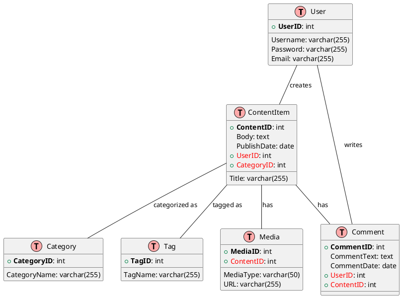

# Content Management System (CMS) Reference Architecture

The Content Management System (CMS) serves as a platform to facilitate content creation, organization, publishing, and user engagement. This reference architecture demonstrates the key entities and relationships inherent in a typical CMS.

## Entities and Relationships

The primary entities in a CMS include `User`, `Content Item`, `Category`, `Tag`, `Media`, and `Comment`. Here's a simplified ER diagram representing these entities and their relationships:

## Entity Descriptions
- User: Represents an individual user who can create content items and write comments.
- Content Item: Represents individual pieces of content, associated with a user, category, media, and comments.
- Category: Represents the category under which content items are organized.
- Tag: Represents keywords or tags associated with content items.
- Media: Represents media items associated with content items.
- Comment: Represents comments made by users on content items.

## Relationship Descriptions
- A User can create multiple Content Items and write multiple Comments.
- A Content Item is created by a User, categorized under a Category, can have multiple Media items, and can have multiple Comments.
- A Category can have multiple Content Items.
- A Tag can be associated with multiple Content Items.
- A Media item is associated with a Content Item.
- A Comment is written by a User on a Content Item.

This simplified CMS model serves as a basis for understanding the relationships and interactions within a content management system. It can be further expanded or modified to meet the specific needs of different content-driven platforms.