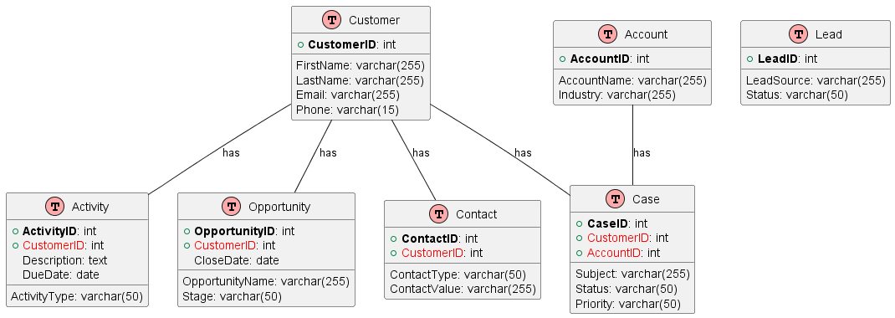

# CRM Entity-Relationship Model

Customer Relationship Management (CRM) systems are crucial for managing an 
organization's interactions with customers and potential customers.
A well-designed CRM model helps in understanding customer behaviors,
managing relationships, and enhancing sales and support processes.

Below is a reference entity-relationship model for a typical CRM system illustrated using PlantUML.

## Entities and Relationships

In a typical CRM system, the primary entities include 
`Customer`, `Contact`, `Opportunity`, `Lead`, `Account`, `Case`, and `Activity`.

Here is a simplified ER diagram representing these entities and their relationships:

```plantuml
@startuml

!define table(x) class x << (T,#FFAAAA) >>
!define primary_key(x) <b>x</b>
!define foreign_key(x) <color:red>x</color>

table(Customer) {
  +primary_key(CustomerID): int
  FirstName: varchar(255)
  LastName: varchar(255)
  Email: varchar(255)
  Phone: varchar(15)
}

table(Contact) {
  +primary_key(ContactID): int
  +foreign_key(CustomerID): int
  ContactType: varchar(50)
  ContactValue: varchar(255)
}

table(Opportunity) {
  +primary_key(OpportunityID): int
  +foreign_key(CustomerID): int
  OpportunityName: varchar(255)
  Stage: varchar(50)
  CloseDate: date
}

table(Lead) {
  +primary_key(LeadID): int
  LeadSource: varchar(255)
  Status: varchar(50)
}

table(Account) {
  +primary_key(AccountID): int
  AccountName: varchar(255)
  Industry: varchar(255)
}

table(Case) {
  +primary_key(CaseID): int
  +foreign_key(CustomerID): int
  +foreign_key(AccountID): int
  Subject: varchar(255)
  Status: varchar(50)
  Priority: varchar(50)
}

table(Activity) {
  +primary_key(ActivityID): int
  +foreign_key(CustomerID): int
  ActivityType: varchar(50)
  Description: text
  DueDate: date
}

Customer -- Contact : has
Customer -- Opportunity : has
Customer -- Case : has
Customer -- Activity : has
Account -- Case : has

@enduml
```

# Entity Descriptions
- Customer: Central entity representing individual customers.
- Contact: Contains contact information related to customers.
- Opportunity: Represents sales opportunities with customers.
- Lead: Represents potential customers or leads.
- Account: Represents business accounts.
- Case: Contains support or service cases related to customers and accounts.
- Activity: Represents various activities or interactions with customers.

# Relationship Descriptions
A Customer can have multiple Contacts, Opportunities, Cases, and Activities.

An Account can have multiple Cases.

Each Contact, Opportunity, Case, and Activity is associated with one Customer.

Each Case may be associated with an Account.

This simplified CRM model serves as a basis for understanding the relationships and interactions within a CRM system. It can be further expanded or modified to meet the specific needs of different organizations.

# CRM System Use-Cases

A CRM system is central to managing customer interactions, sales processes, and support services. Here are some valid use-cases to provide a complete picture of a CRM system's operations:

## 1. Customer Management

```plantuml
@startuml
left to right direction
actor "Sales Rep" as sales
actor "Customer" as customer
rectangle "Customer Management" {
  sales -- (Create Customer Profile) : <<extends>>
  (Create Customer Profile) -- (Update Customer Profile) : <<extends>>
  (Create Customer Profile) -- (Delete Customer Profile) : <<extends>>
  customer -- (View Customer Profile)
}
@enduml
```

- Create Customer Profile: Sales representatives can create profiles for new customers.
- Update Customer Profile: Sales representatives can update existing customer profiles.
- Delete Customer Profile: Sales representatives can delete customer profiles.
- View Customer Profile: Customers can view their own profiles.

## 2. Sales Management

```plantuml
@startuml
left to right direction
actor "Sales Rep" as sales
rectangle "Sales Management" {
  sales -- (Create Sales Opportunity) : <<extends>>
  (Create Sales Opportunity) -- (Update Sales Opportunity) : <<extends>>
  (Create Sales Opportunity) -- (Delete Sales Opportunity) : <<extends>>
  (Create Sales Opportunity) -- (Convert Opportunity to Sale)
}
@enduml
```

- Create Sales Opportunity: Sales representatives can create sales opportunities.
- Update Sales Opportunity: Sales representatives can update existing sales opportunities.
- Delete Sales Opportunity: Sales representatives can delete sales opportunities.
- Convert Opportunity to Sale: Sales representatives can convert opportunities to actual sales.

## 3. Support Management

```plantuml
@startuml
left to right direction
actor "Support Rep" as support
actor "Customer" as customer
rectangle "Support Management" {
  customer -- (Create Support Case) : <<extends>>
  (Create Support Case) -- (Update Support Case) : <<extends>>
  (Create Support Case) -- (Close Support Case) : <<extends>>
  support -- (Respond to Support Case)
}
@enduml
```

- Create Support Case: Customers can create support cases.
- Update Support Case: Customers can update existing support cases.
- Close Support Case: Customers can close resolved support cases.
- Respond to Support Case: Support representatives can respond to support cases.

These use-cases outline the core functionalities and interactions within a CRM system, enabling better customer relationship management, sales processes, and support services.
