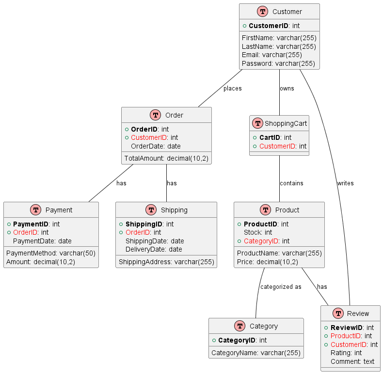

# E-Commerce System Reference Architecture

The E-Commerce system is a quintessential online retail platform that facilitates the buying and selling of products. This reference architecture demonstrates key aspects such as inventory management, online transactions, user authentication, and digital marketing.

## Entities and Relationships

The primary entities in this system include `Product`, `Customer`, `Order`, `Shopping Cart`, `Payment`, `Shipping`, `Category`, and `Review`. Here's a simplified ER diagram representing these entities and their relationships:

```plantuml
@startuml

!define table(x) class x << (T,#FFAAAA) >>
!define primary_key(x) <b>x</b>
!define foreign_key(x) <color:red>x</color>

table(Product) {
  +primary_key(ProductID): int
  ProductName: varchar(255)
  Price: decimal(10,2)
  Stock: int
  +foreign_key(CategoryID): int
}

table(Customer) {
  +primary_key(CustomerID): int
  FirstName: varchar(255)
  LastName: varchar(255)
  Email: varchar(255)
  Password: varchar(255)
}

table(Order) {
  +primary_key(OrderID): int
  +foreign_key(CustomerID): int
  OrderDate: date
  TotalAmount: decimal(10,2)
}

table(ShoppingCart) {
  +primary_key(CartID): int
  +foreign_key(CustomerID): int
}

table(Payment) {
  +primary_key(PaymentID): int
  +foreign_key(OrderID): int
  PaymentMethod: varchar(50)
  PaymentDate: date
  Amount: decimal(10,2)
}

table(Shipping) {
  +primary_key(ShippingID): int
  +foreign_key(OrderID): int
  ShippingAddress: varchar(255)
  ShippingDate: date
  DeliveryDate: date
}

table(Category) {
  +primary_key(CategoryID): int
  CategoryName: varchar(255)
}

table(Review) {
  +primary_key(ReviewID): int
  +foreign_key(ProductID): int
  +foreign_key(CustomerID): int
  Rating: int
  Comment: text
}

Product -- Category : categorized as
Product -- Review : has
Customer -- ShoppingCart : owns
Customer -- Order : places
Customer -- Review : writes
Order -- Payment : has
Order -- Shipping : has
ShoppingCart -- Product : contains

@enduml
```

## Entity Descriptions

- Product: Represents the items available for purchase, associated with categories and reviews.
- Customer: Represents the users of the platform with their essential information.
- Order: Captures the details of customer orders.
Shopping Cart: Holds products that a customer intends to purchase.
- Payment: Records payment transactions for orders.
- Shipping: Manages shipping information for orders.
- Category: Classifies products into various categories.
- Review: Holds customer reviews for products.

## Relationship Descriptions
- A Product is categorized under a Category and can have multiple Reviews.
- A Customer can own a Shopping Cart, place multiple Orders, and write multiple Reviews.
- An Order is associated with a Payment and Shipping detail.
- A Shopping Cart can contain multiple Products.

This simplified E-Commerce model serves as a basis for understanding the relationships and interactions within an online retail system. It can be further expanded or modified to meet the specific needs of different E-Commerce platforms.