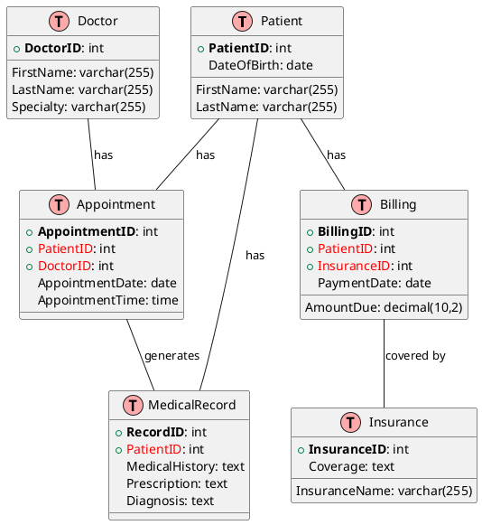

# Healthcare Management System Reference Architecture

The Healthcare Management System serves as a platform to facilitate patient care, appointment scheduling, and medical billing. This reference architecture demonstrates the key entities and relationships inherent in a typical Healthcare Management System.

## Entities and Relationships

The primary entities in a Healthcare Management System include `Patient`, `Doctor`, `Appointment`, `Medical Record`, `Billing`, and `Insurance`. Here's a simplified ER diagram representing these entities and their relationships:

## Entity Descriptions
- Patient: Represents an individual patient with personal details.
- Doctor: Represents a medical doctor with specialization details.
- Appointment: Represents a scheduled appointment between a patient and a doctor.
- Medical Record: Contains medical history, prescriptions, and diagnoses of a patient.
- Billing: Represents the billing information related to a patient's treatment.
- Insurance: Represents the insurance details covering the patient's medical expenses.

## Relationship Descriptions
- A Patient can have multiple Appointments, Medical Records, and Billings.
- A Doctor can have multiple Appointments.
- An Appointment is scheduled between a Patient and a Doctor, and can generate a Medical Record.
- A Billing record is associated with a Patient and an Insurance.

This simplified Healthcare Management System model serves as a basis for understanding the relationships and interactions within a healthcare setting. It can be further expanded or modified to meet the specific needs of different healthcare institutions.

