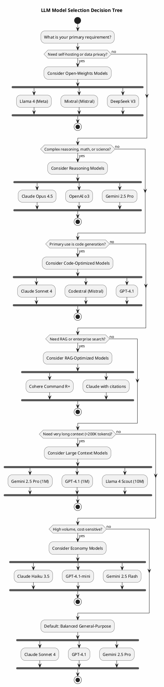

# LLM Model Guide

A comprehensive guide to LLM providers, their models, strengths, weaknesses, and selection criteria.

## Overview


## Model Providers

### Anthropic (Claude)

| Model | Context | Best For |
|-------|---------|----------|
| Claude Opus 4.5 | 200K | Complex reasoning, agentic tasks, multi-step analysis |
| Claude Sonnet 4 | 200K | Balanced performance/cost, coding, general tasks |
| Claude Haiku 3.5 | 200K | Fast responses, high-volume, cost-sensitive tasks |

**Strengths:**
- Industry-leading code generation and understanding
- Excellent instruction following
- Strong safety and alignment
- Extended thinking mode for complex reasoning
- Large context window (200K tokens)
- Consistent, nuanced outputs

**Weaknesses:**
- No native image generation
- Higher cost than some alternatives for simple tasks
- Limited real-time/live data access

**API Documentation:** [docs.anthropic.com](https://docs.anthropic.com/en/docs/about-claude/models/all-models)

---

### OpenAI (GPT)

| Model | Context | Best For |
|-------|---------|----------|
| GPT-4.1 | 1M | Latest flagship, complex tasks, long context |
| GPT-4.1-mini | 1M | Cost-effective, fast responses |
| GPT-4.1-nano | 1M | Lightweight tasks, high volume |
| o3 | 200K | Complex reasoning, math, science |
| o4-mini | 200K | Reasoning at lower cost |

**Strengths:**
- Massive ecosystem and tooling
- Multimodal (vision, audio, code)
- Strong general knowledge
- Extensive fine-tuning options
- Image generation (DALL-E integration)
- Wide third-party integration support

**Weaknesses:**
- Can be verbose
- Reasoning models (o-series) have higher latency
- Cost can escalate with heavy usage
- Occasional hallucinations on niche topics

**API Documentation:** [platform.openai.com/docs/models](https://platform.openai.com/docs/models)

---

### Google (Gemini)

| Model | Context | Best For |
|-------|---------|----------|
| Gemini 2.5 Pro | 1M | Long-form analysis, complex reasoning |
| Gemini 2.5 Flash | 1M | Fast, cost-effective |
| Gemini 2.0 Flash | 1M | Balanced performance |
| Gemini 2.0 Flash-Lite | 1M | Lightweight tasks |

**Strengths:**
- Massive context window (up to 1M tokens)
- Native multimodal (text, image, video, audio)
- Strong math and science capabilities
- Competitive pricing
- Deep Google ecosystem integration
- Built-in grounding with Google Search

**Weaknesses:**
- Less consistent than competitors on some tasks
- Newer ecosystem, fewer integrations
- Safety filters can be overly restrictive

**API Documentation:** [ai.google.dev/gemini-api/docs/models](https://ai.google.dev/gemini-api/docs/models/gemini)

---

### Meta (Llama)

| Model | Context | Best For |
|-------|---------|----------|
| Llama 4 Scout | 10M | Massive context tasks |
| Llama 4 Maverick | 1M | General flagship tasks |
| Llama 3.3 70B | 128K | Self-hosted, balanced |
| Llama 3.2 Vision | 128K | Multimodal tasks |

**Strengths:**
- Open source / open weights
- Can self-host (no API costs)
- Strong community and fine-tuning ecosystem
- No usage restrictions (permissive license)
- Good performance-to-size ratio
- Privacy-friendly (on-premise deployment)

**Weaknesses:**
- Requires infrastructure for self-hosting
- Smaller context than commercial APIs (except Llama 4)
- Less polished than commercial offerings
- Fine-tuning requires expertise

**Model Hub:** [llama.meta.com](https://llama.meta.com/) | [huggingface.co/meta-llama](https://huggingface.co/meta-llama)

---

### Mistral

| Model | Context | Best For |
|-------|---------|----------|
| Mistral Large | 128K | Complex reasoning, coding |
| Mistral Medium | 32K | Balanced tasks |
| Mistral Small | 32K | Cost-effective tasks |
| Codestral | 32K | Code generation |
| Mixtral 8x22B | 64K | Open-weights, MoE efficiency |

**Strengths:**
- Excellent code generation (Codestral)
- Open-weights options available
- Strong European compliance (GDPR)
- Competitive performance/cost ratio
- Fast inference
- Mixture-of-Experts architecture

**Weaknesses:**
- Smaller ecosystem than major providers
- Less multimodal capability
- Fewer enterprise integrations
- Documentation less comprehensive

**API Documentation:** [docs.mistral.ai](https://docs.mistral.ai/)

---

### Cohere

| Model | Context | Best For |
|-------|---------|----------|
| Command R+ | 128K | RAG, enterprise search |
| Command R | 128K | General enterprise tasks |
| Embed v3 | - | Embeddings, semantic search |
| Rerank v3 | - | Search result ranking |

**Strengths:**
- Purpose-built for RAG and enterprise
- Excellent retrieval augmentation
- Strong multilingual support (100+ languages)
- Built-in citation and grounding
- Enterprise security features
- Specialized embedding models

**Weaknesses:**
- Less capable for general creative tasks
- Smaller model selection
- Less community tooling
- Higher cost for non-RAG use cases

**API Documentation:** [docs.cohere.com](https://docs.cohere.com/)

---

### Amazon (Bedrock)

| Model | Context | Best For |
|-------|---------|----------|
| Amazon Nova Pro | 300K | Complex tasks |
| Amazon Nova Lite | 300K | Cost-effective |
| Amazon Nova Micro | 128K | Text-only, fast |
| Amazon Titan | 128K | Embeddings, legacy |

**Strengths:**
- Deep AWS integration
- Multi-model access (Claude, Llama, etc.)
- Enterprise compliance
- Guardrails built-in
- Knowledge bases integration
- Pay-per-use pricing

**Weaknesses:**
- Nova models still maturing
- Requires AWS ecosystem buy-in
- Can be complex to configure
- Variable model availability by region

**API Documentation:** [docs.aws.amazon.com/bedrock](https://docs.aws.amazon.com/bedrock/)

---

### xAI (Grok)

| Model | Context | Best For |
|-------|---------|----------|
| Grok 3 | 128K | General reasoning |
| Grok 3 Mini | 128K | Fast, cost-effective |

**Strengths:**
- Real-time information access (X/Twitter)
- Competitive reasoning capabilities
- Fast inference
- Growing quickly

**Weaknesses:**
- Newer, less proven
- Smaller ecosystem
- Limited enterprise features
- Fewer integrations

**API Documentation:** [docs.x.ai](https://docs.x.ai/)

---

### DeepSeek

| Model | Context | Best For |
|-------|---------|----------|
| DeepSeek V3 | 128K | General tasks, coding |
| DeepSeek R1 | 128K | Complex reasoning |
| DeepSeek Coder | 128K | Code generation |

**Strengths:**
- Extremely cost-effective
- Strong coding capabilities
- Open-weights available
- Competitive with top models
- MoE architecture efficiency

**Weaknesses:**
- Data residency concerns (China-based)
- Reliability/uptime questions
- Limited enterprise support
- Potential compliance issues

**API Documentation:** [platform.deepseek.com](https://platform.deepseek.com/)

---

## Finding Latest Model Names

### Official Sources

| Provider | Where to Find Models |
|----------|---------------------|
| Anthropic | [docs.anthropic.com/en/docs/about-claude/models](https://docs.anthropic.com/en/docs/about-claude/models/all-models) |
| OpenAI | [platform.openai.com/docs/models](https://platform.openai.com/docs/models) |
| Google | [ai.google.dev/gemini-api/docs/models](https://ai.google.dev/gemini-api/docs/models/gemini) |
| Meta | [llama.meta.com](https://llama.meta.com/) |
| Mistral | [docs.mistral.ai/getting-started/models](https://docs.mistral.ai/getting-started/models/) |
| Cohere | [docs.cohere.com/docs/models](https://docs.cohere.com/docs/models) |
| AWS Bedrock | [docs.aws.amazon.com/bedrock/latest/userguide/models-supported.html](https://docs.aws.amazon.com/bedrock/latest/userguide/models-supported.html) |

### API Discovery

Most providers offer programmatic model listing:

```python
# OpenAI
import openai
models = openai.models.list()

# Anthropic
import anthropic
# Check docs - model IDs in API reference

# Google
import google.generativeai as genai
models = genai.list_models()
```

### Community Resources

| Resource | URL | Notes |
|----------|-----|-------|
| Hugging Face | [huggingface.co/models](https://huggingface.co/models) | Open-weights models |
| LMSys Chatbot Arena | [chat.lmsys.org](https://chat.lmsys.org/) | Model rankings |
| Artificial Analysis | [artificialanalysis.ai](https://artificialanalysis.ai/) | Benchmarks, pricing |
| OpenRouter | [openrouter.ai/models](https://openrouter.ai/models) | Multi-provider gateway |

---

## Model Selection Criteria

### Decision Factors

| Factor | Questions to Ask |
|--------|-----------------|
| **Task Type** | Coding? Creative writing? Analysis? RAG? |
| **Context Needs** | How much input data? Single query or conversation? |
| **Latency** | Real-time chat? Batch processing? |
| **Cost** | Per-token budget? Volume discounts? |
| **Privacy** | Can data leave your infrastructure? |
| **Compliance** | GDPR, HIPAA, SOC2 requirements? |
| **Multimodal** | Need images, audio, video? |

### Task-Based Recommendations

| Use Case | Recommended Models | Reasoning |
|----------|-------------------|-----------|
| **Code Generation** | Claude Sonnet 4, GPT-4.1, Codestral | Strong code understanding |
| **Complex Reasoning** | Claude Opus 4.5, o3, Gemini 2.5 Pro | Extended thinking, chain-of-thought |
| **High Volume/Low Cost** | Claude Haiku, GPT-4.1-mini, Gemini Flash | Cost-effective, fast |
| **RAG/Enterprise Search** | Cohere Command R+, Claude | Built-in retrieval, citations |
| **Long Documents** | Gemini 2.5 Pro, GPT-4.1, Claude | Large context windows |
| **Self-Hosted/Private** | Llama 4, Mixtral, DeepSeek | Open weights, on-premise |
| **Multimodal** | GPT-4.1, Gemini 2.5, Claude | Vision + text native |
| **Real-time/Chat** | Claude Haiku, GPT-4.1-mini | Low latency |

### Cost Comparison (Approximate)

| Tier | Models | Typical Cost (per 1M tokens) |
|------|--------|------------------------------|
| **Premium** | Claude Opus, GPT-4.1, o3 | $15-75 input, $60-150 output |
| **Balanced** | Claude Sonnet, GPT-4.1, Gemini Pro | $3-10 input, $10-30 output |
| **Economy** | Claude Haiku, GPT-4.1-mini, Gemini Flash | $0.25-1 input, $1-4 output |
| **Budget** | DeepSeek, open-source hosted | $0.10-0.50 input, $0.30-1 output |

*Note: Prices change frequently. Check provider documentation for current rates.*

---

## Selection Flowchart

```
START: What's your primary requirement?
    |
    +-- Need self-hosting/privacy? --> Llama 4, Mixtral, DeepSeek (open weights)
    |
    +-- Complex reasoning/math? --> Claude Opus 4.5, o3, Gemini 2.5 Pro
    |
    +-- Code generation? --> Claude Sonnet 4, Codestral, GPT-4.1
    |
    +-- RAG/Enterprise search? --> Cohere Command R+, Claude
    |
    +-- Long context (>200K)? --> Gemini 2.5 Pro (1M), GPT-4.1 (1M)
    |
    +-- Multimodal (images/video)? --> Gemini 2.5, GPT-4.1, Claude
    |
    +-- High volume/low cost? --> Claude Haiku, GPT-4.1-mini, Gemini Flash
    |
    +-- General purpose balanced? --> Claude Sonnet 4, GPT-4.1
```

---

## Best Practices

1. **Start with balanced models** - Begin with mid-tier (Sonnet, GPT-4.1) then optimize
2. **Benchmark on your data** - Generic benchmarks don't reflect your specific use case
3. **Consider total cost** - Include tokens, latency, development time, reliability
4. **Plan for fallbacks** - Don't depend on a single provider
5. **Monitor quality** - Models update; re-evaluate periodically
6. **Use caching** - Reduce costs and latency with response caching
7. **Right-size context** - Larger isn't always better; match to need

## Anti-Patterns

| Anti-Pattern | Problem | Solution |
|--------------|---------|----------|
| Always using largest model | Unnecessary cost, latency | Match model to task complexity |
| Single provider dependency | Outages cause total failure | Implement fallback providers |
| Ignoring context limits | Truncation, errors | Monitor usage, implement chunking |
| Not versioning model IDs | Breaking changes on updates | Pin specific model versions |
| Skipping cost monitoring | Budget overruns | Set alerts, use dashboards |

---

## Related Patterns

| Pattern | Relationship |
|---------|-------------|
| [LLM Tool Call](llm-tool-call.md) | Models with strong function calling |
| [LLM Context Management](llm-context-management.md) | Managing context across model limits |
| [Agent Orchestration](agent-orchestration.md) | Selecting models for different agent roles |
| [Agentic RAG](agentic-rag.md) | Embedding models for retrieval |

---

## PlantUML Source


