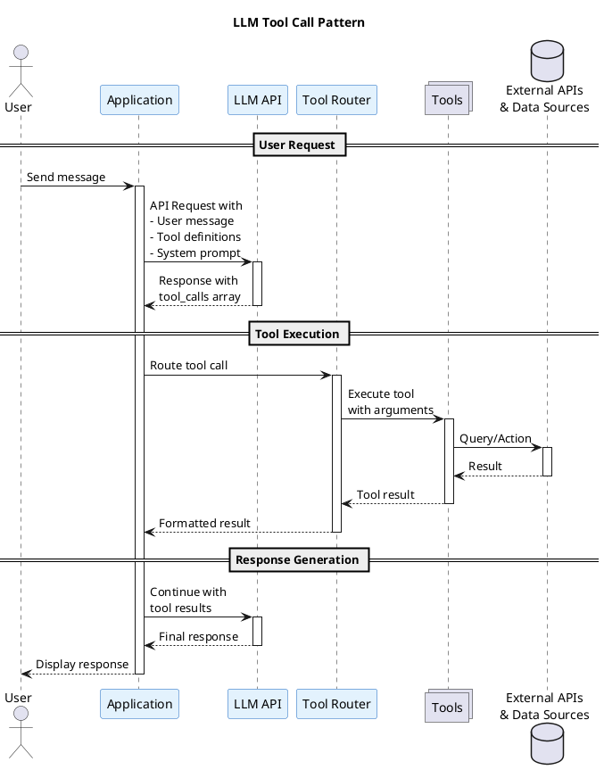

# LLM Tool Call Pattern

The Tool Call pattern (also known as Function Calling) enables Large Language Models to interact with external systems, APIs, and data sources by invoking predefined tools during a conversation.

## Overview


## Pattern Description

This pattern allows LLMs to:
1. Analyze user requests and determine when external data or actions are needed
2. Generate structured tool calls with appropriate arguments
3. Process tool results and incorporate them into natural language responses

## Components

### User
- **Purpose**: Initiates conversations and requests
- **Interaction**: Sends natural language messages through the application

### Application
- **Purpose**: Orchestrates the conversation flow between user and LLM
- **Key Responsibilities**:
  - Manages conversation state
  - Sends tool definitions to the LLM
  - Executes tool calls and returns results
  - Presents final responses to users

### LLM API
- **Purpose**: Processes messages and decides when tools are needed
- **Key Features**:
  - Analyzes user intent
  - Generates structured tool calls (name + JSON arguments)
  - Synthesizes tool results into coherent responses

### Tool Router
- **Purpose**: Routes tool calls to appropriate handlers
- **Key Features**:
  - Validates tool call parameters
  - Dispatches to correct tool implementation
  - Handles errors and timeouts

### Tools
- **Purpose**: Execute specific functions/actions
- **Examples**:
  - `get_weather(location, units)`
  - `search_database(query, filters)`
  - `send_email(to, subject, body)`
  - `calculate(expression)`
  - `fetch_url(url)`

### External APIs & Data Sources
- **Purpose**: Provide real-time data and capabilities
- **Examples**:
  - Weather APIs
  - Databases
  - Web services
  - File systems

## Sequence Flow

| Step | From | To | Description |
|------|------|----|-------------|
| 1 | User | Application | User sends a message |
| 2 | Application | LLM API | Request includes message + tool definitions |
| 3 | LLM API | Application | LLM returns tool_calls if needed |
| 4 | Application | Tool Router | Route each tool call |
| 5 | Tool Router | Tools | Execute with provided arguments |
| 6 | Tools | External | Query APIs or data sources |
| 7 | External | Tools | Return results |
| 8 | Tools | Application | Return formatted results |
| 9 | Application | LLM API | Continue conversation with results |
| 10 | LLM API | Application | Generate final response |
| 11 | Application | User | Display response |

## Tool Definition Example

```json
{
  "type": "function",
  "function": {
    "name": "get_weather",
    "description": "Get current weather for a location",
    "parameters": {
      "type": "object",
      "properties": {
        "location": {
          "type": "string",
          "description": "City name or coordinates"
        },
        "units": {
          "type": "string",
          "enum": ["celsius", "fahrenheit"],
          "default": "celsius"
        }
      },
      "required": ["location"]
    }
  }
}
```

## Tool Call Response Example

```json
{
  "role": "assistant",
  "content": null,
  "tool_calls": [
    {
      "id": "call_abc123",
      "type": "function",
      "function": {
        "name": "get_weather",
        "arguments": "{\"location\": \"San Francisco\", \"units\": \"celsius\"}"
      }
    }
  ]
}
```

## When to Use

- **Real-time Data**: Weather, stock prices, news, live sports scores
- **Database Queries**: Searching internal knowledge bases or documents
- **Calculations**: Complex math, unit conversions, financial calculations
- **External Actions**: Sending emails, creating calendar events, file operations
- **API Integrations**: Third-party services (Slack, GitHub, Jira, etc.)
- **Agentic Workflows**: Multi-step tasks requiring multiple tool calls

## Implementation Considerations

### Security
- Validate all tool arguments before execution
- Implement rate limiting and quotas
- Use principle of least privilege for tool permissions
- Sanitize outputs to prevent injection attacks

### Error Handling
- Return clear error messages for tool failures
- Implement retries with exponential backoff
- Provide fallback responses when tools fail

### Performance
- Execute independent tool calls in parallel
- Cache frequently-requested data
- Set appropriate timeouts for external calls

### Design Principles
- Keep tool definitions clear and focused
- Use descriptive names and parameter descriptions
- Return structured data that LLMs can easily interpret
- Log all tool calls for debugging and auditing

## Related Patterns

| Pattern | Relationship |
|---------|-------------|
| [Agentic RAG](agentic-rag.md) | Uses tool calls for retrieval |
| ReAct (Reasoning + Acting) | Combines reasoning with tool use |
| Chain of Thought | Reasoning before tool selection |

## PlantUML Source



