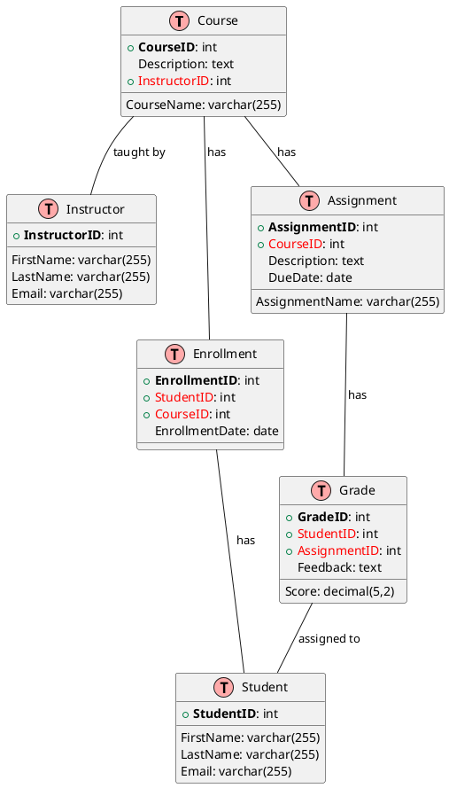

# Learning Management System (LMS) Reference Architecture

The Learning Management System (LMS) serves as a platform to facilitate online education, manage content, engage students, and track performance. This reference architecture demonstrates the key entities and relationships inherent in a typical LMS.

## Entities and Relationships

The primary entities in an LMS include `Course`, `Instructor`, `Student`, `Enrollment`, `Assignment`, and `Grade`. Here's a simplified ER diagram representing these entities and their relationships:

## Entity Descriptions
- Course: Represents an individual course offered, associated with an instructor, enrollments, and assignments.
- Instructor: Represents the instructor or teacher of a course.
- Student: Represents a student enrolled in courses.
- Enrollment: Captures the enrollment of students in courses.
- Assignment: Represents tasks or assignments related to a course.
- Grade: Records the grades of students on assignments.

## Relationship Descriptions
- A Course is taught by an Instructor, has multiple Enrollments, and has multiple Assignments.
- An Instructor teaches multiple Courses.
- A Student has multiple Enrollments and is assigned multiple Grades.
- An Enrollment is associated with one Student and one Course.
- An Assignment is associated with a Course and has multiple Grades.
- A Grade is assigned to a Student for an Assignment.

This simplified LMS model serves as a basis for understanding the relationships and interactions within a learning management system. It can be further expanded or modified to meet the specific needs of different educational institutions or online education platforms.