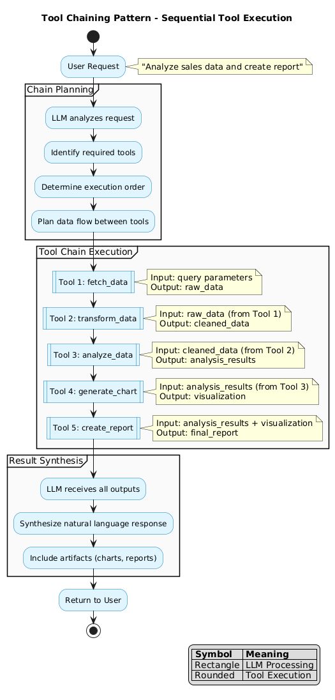

# Tool Chaining Pattern - Sequential Tool Execution

The Tool Chaining pattern enables LLMs to execute multiple tools in sequence, where each tool's output becomes input for subsequent tools.

## Overview



## Pattern Description

Tool chaining allows complex workflows by:
1. Planning a sequence of tool executions
2. Passing outputs from one tool to the next
3. Building up results incrementally
4. Synthesizing final output from all results

## Chain Phases

### 1. Chain Planning
The LLM analyzes the request and determines:
- Which tools are needed
- Execution order based on data dependencies
- How data flows between tools

### 2. Chain Execution
Tools execute sequentially:
- Each tool receives its required inputs
- Outputs are captured and passed forward
- Errors can trigger replanning

### 3. Result Synthesis
The LLM combines all outputs:
- Interprets results in context
- Generates natural language response
- Includes artifacts (files, charts, etc.)

## Example Chain

**User Request**: "Analyze our Q4 sales and create a presentation"

| Step | Tool | Input | Output |
|------|------|-------|--------|
| 1 | `query_database` | SQL query | Raw sales data |
| 2 | `transform_data` | Raw data | Cleaned dataset |
| 3 | `calculate_metrics` | Cleaned data | KPIs, trends |
| 4 | `generate_charts` | Metrics | Visualizations |
| 5 | `create_slides` | Metrics + charts | Presentation |

## Data Flow Patterns

### Linear Chain
```
Tool A → Tool B → Tool C → Result
```

### Fan-Out
```
        ┌→ Tool B ─┐
Tool A ─┤          ├→ Tool D
        └→ Tool C ─┘
```

### Fan-In
```
Tool A ─┐
        ├→ Tool C → Result
Tool B ─┘
```

### Conditional
```
Tool A → [condition] → Tool B (if true)
                    → Tool C (if false)
```

## Chain Definition

```json
{
  "chain_id": "sales_analysis",
  "steps": [
    {
      "id": "fetch",
      "tool": "query_database",
      "inputs": { "query": "SELECT * FROM sales WHERE quarter='Q4'" },
      "outputs": ["raw_data"]
    },
    {
      "id": "clean",
      "tool": "transform_data",
      "inputs": { "data": "${fetch.raw_data}" },
      "outputs": ["clean_data"]
    },
    {
      "id": "analyze",
      "tool": "calculate_metrics",
      "inputs": { "data": "${clean.clean_data}" },
      "outputs": ["metrics", "trends"]
    },
    {
      "id": "visualize",
      "tool": "generate_charts",
      "inputs": {
        "metrics": "${analyze.metrics}",
        "trends": "${analyze.trends}"
      },
      "outputs": ["charts"]
    }
  ]
}
```

## Error Handling

| Error Type | Strategy |
|------------|----------|
| Tool failure | Retry with backoff |
| Invalid output | Replan chain |
| Timeout | Skip or use cached result |
| Dependency missing | Request from user |

## When to Use

- Multi-step data processing workflows
- Tasks requiring incremental transformation
- Complex analysis requiring multiple tools
- Report generation pipelines
- ETL-style operations

## Best Practices

### Chain Design
- Keep chains as short as possible
- Make each step idempotent when possible
- Include validation between steps
- Cache intermediate results

### Data Passing
- Use typed schemas for tool outputs
- Validate data between steps
- Handle missing/null values
- Transform data formats as needed

### Performance
- Execute independent branches in parallel
- Stream large data when possible
- Set appropriate timeouts per step
- Monitor chain execution time

## Benefits

| Benefit | Description |
|---------|-------------|
| **Composability** | Combine simple tools for complex tasks |
| **Reusability** | Chains can be templated and reused |
| **Debuggability** | Inspect intermediate results |
| **Flexibility** | Modify chain steps as needed |

## Related Patterns

| Pattern | Relationship |
|---------|-------------|
| [LLM Tool Call](llm-tool-call.md) | Single tool calls compose into chains |
| [Skills Pattern](skills-pattern.md) | Skills may use tool chains internally |
| [Agent Orchestration](agent-orchestration.md) | Agents execute tool chains |
