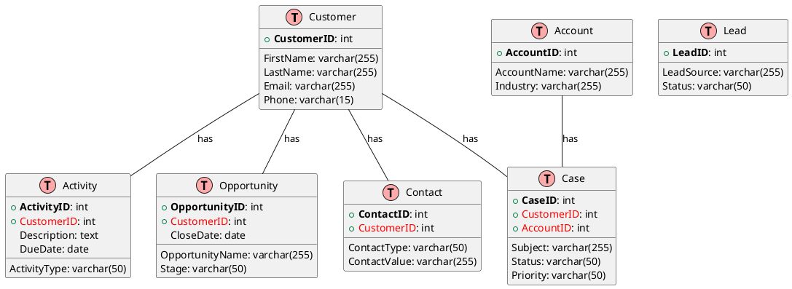
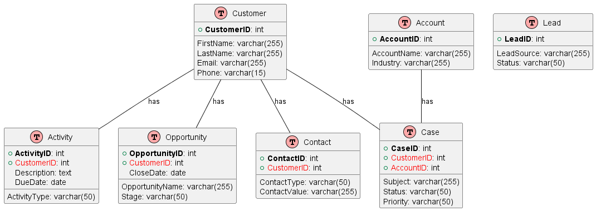

# CRM Entity-Relationship Model

Customer Relationship Management (CRM) systems are crucial for managing an 
organization's interactions with customers and potential customers.
A well-designed CRM model helps in understanding customer behaviors,
managing relationships, and enhancing sales and support processes.

Below is a reference entity-relationship model for a typical CRM system illustrated using PlantUML.

## Entities and Relationships

In a typical CRM system, the primary entities include 
`Customer`, `Contact`, `Opportunity`, `Lead`, `Account`, `Case`, and `Activity`.

Here is a simplified ER diagram representing these entities and their relationships:

# Entity Descriptions
- Customer: Central entity representing individual customers.
- Contact: Contains contact information related to customers.
- Opportunity: Represents sales opportunities with customers.
- Lead: Represents potential customers or leads.
- Account: Represents business accounts.
- Case: Contains support or service cases related to customers and accounts.
- Activity: Represents various activities or interactions with customers.

# Relationship Descriptions
A Customer can have multiple Contacts, Opportunities, Cases, and Activities.

An Account can have multiple Cases.

Each Contact, Opportunity, Case, and Activity is associated with one Customer.

Each Case may be associated with an Account.

This simplified CRM model serves as a basis for understanding the relationships and interactions within a CRM system. It can be further expanded or modified to meet the specific needs of different organizations.
