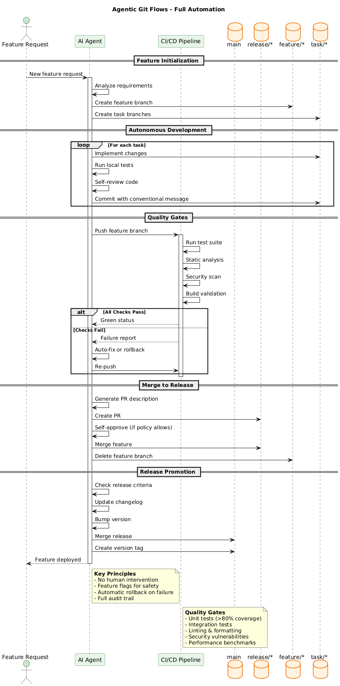

# Agentic Git Flows

Fully automated branching strategy where AI agents autonomously manage the entire development lifecycle.

## Overview



## Pattern Description

This pattern enables AI agents to independently:
- Create and manage branches
- Implement features and fixes
- Run quality checks
- Merge code when criteria are met
- Deploy to production

**Automation Level:** 100%
**Human Intervention:** Minimal (override only)

## Branch Structure

```
main (production)
 └── release/* (release candidates)
      └── feature/* (agent-driven features)
           └── task/* (micro-tasks)
```

| Branch | Purpose | Lifetime | Owner |
|--------|---------|----------|-------|
| `main` | Production code | Permanent | Agent |
| `release/*` | Release candidates | Per release | Agent |
| `feature/*` | Feature development | Per feature | Agent |
| `task/*` | Micro-tasks | Per task | Agent |

## Workflow Phases

### 1. Feature Initialization
- Agent receives feature request (issue, ticket, or message)
- Analyzes requirements and creates execution plan
- Creates feature branch from latest release
- Breaks down into task branches if complex

### 2. Autonomous Development
- Agent implements changes in task branches
- Runs local tests after each change
- Self-reviews code against style guidelines
- Commits with conventional commit messages
- Merges completed tasks into feature branch

### 3. Quality Gates
```
┌─────────────────────────────────────────────┐
│              CI/CD Pipeline                 │
├─────────────────────────────────────────────┤
│  ✓ Unit Tests (>80% coverage)              │
│  ✓ Integration Tests                        │
│  ✓ Static Analysis (linting, formatting)   │
│  ✓ Security Scan (vulnerabilities, SAST)   │
│  ✓ Build Validation                        │
│  ✓ Performance Benchmarks                  │
└─────────────────────────────────────────────┘
```

### 4. Merge Strategy
- Agent generates PR with auto-description
- Self-approves if policy allows
- Merges to release branch
- Deletes feature branch

### 5. Release Promotion
- Agent monitors release criteria
- Updates changelog automatically
- Bumps version following semver
- Merges to main and tags
- Deploys to production

## Key Features

| Feature | Description |
|---------|-------------|
| **No Feature Freeze** | Continuous deployment with feature flags |
| **Automatic Testing** | Agents verify all changes before merge |
| **Self-Healing** | Auto-revert broken merges, notify humans |
| **Audit Trail** | All agent actions logged for compliance |
| **Human Override** | Critical changes can require approval |

## Configuration

### Agent Permissions
```yaml
agent:
  branches:
    create: [feature/*, task/*]
    merge: [feature/* -> release/*]
    delete: [feature/*, task/*]
  release:
    create: true
    merge_to_main: true  # or require_approval: true
    tag: true
```

### Quality Gate Thresholds
```yaml
quality_gates:
  test_coverage: 80
  max_complexity: 10
  security_critical: 0
  security_high: 0
  build_time_max: 300
```

### Feature Flags
```yaml
feature_flags:
  enabled: true
  default_state: false
  auto_enable_after: "7d"  # Enable after 7 days of stability
```

## When to Use

✅ **Good Fit:**
- AI-first development teams
- High test coverage (>80%)
- Strong CI/CD infrastructure
- Continuous deployment capability
- Trust in automated decisions

❌ **Poor Fit:**
- Regulatory requirements for human review
- Low test coverage
- Legacy systems without CI/CD
- Teams unfamiliar with automation

## Error Handling

| Scenario | Agent Response |
|----------|----------------|
| Tests fail | Analyze failure, attempt fix, or rollback |
| Merge conflict | Auto-resolve if trivial, else notify human |
| Security issue | Block merge, create security ticket |
| Build failure | Retry, then rollback last change |
| Deployment failure | Automatic rollback to last good version |

## Metrics & Monitoring

Track these KPIs for agentic flows:

| Metric | Target |
|--------|--------|
| Deployment Frequency | Multiple per day |
| Lead Time | < 1 hour |
| Change Failure Rate | < 5% |
| MTTR | < 30 minutes |
| Agent Success Rate | > 95% |

## Related Patterns

- [Agentic Team Flow](agentic-team-flow.md) — Add human oversight
- [Simplified GitFlow](simplified-gitflow.md) — Manual alternative

---

**[← Back to Git Flows Overview](git-flows.md)**
