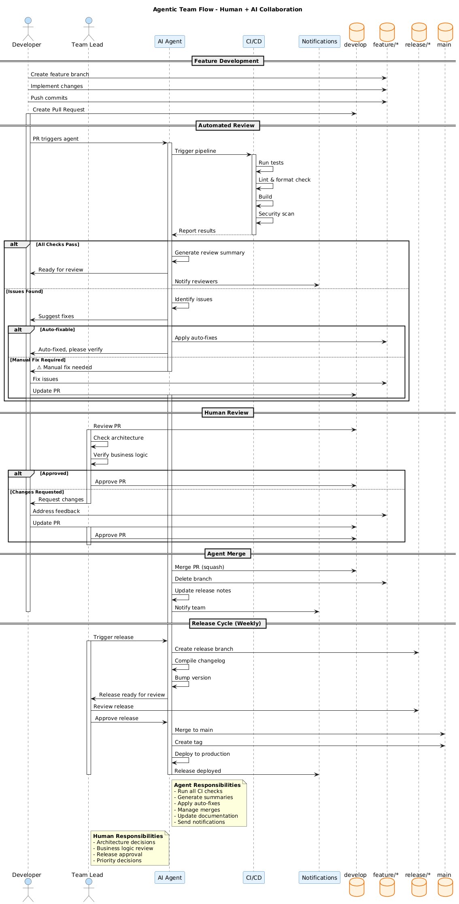

# Git Workflows & Team Flows

This catalogue describes branching strategies for different team sizes and automation levels.

## Quick Comparison

| Flow | Automation | Team Size | Release Cycle | Best For |
|------|------------|-----------|---------------|----------|
| [**Agentic Git Flows**](agentic-git-flows.md) | 100% | Any | Continuous | AI-driven development |
| [**Agentic Team Flow**](agentic-team-flow.md) | ~80% | 3-10 | Weekly | Human + AI collaboration |
| [**Simplified GitFlow**](simplified-gitflow.md) | Manual | 2-5 | Monthly | Small teams, full control |

---

## Agentic Git Flows

[](agentic-git-flows.md)

**Full automation** — AI agents manage the entire development lifecycle autonomously.

- No human intervention required
- Continuous deployment with feature flags
- Self-healing on failures
- Complete audit trail

**→ [Read full documentation](agentic-git-flows.md)**

---

## Agentic Team Flow

[](agentic-team-flow.md)

**Hybrid workflow** — Humans make decisions, agents execute.

- Human approval for all merges
- Automated testing and notifications
- Weekly release cycles
- Balance of speed and oversight

**→ [Read full documentation](agentic-team-flow.md)**

---

## Simplified GitFlow

[](simplified-gitflow.md)

**Traditional approach** — Manual branching for small teams.

- Full human control
- Predictable monthly releases
- Simple and well-understood
- Minimal tooling required

**→ [Read full documentation](simplified-gitflow.md)**

---

## Detailed Comparison

| Aspect | Agentic Flows | Team Flow | Simplified |
|--------|---------------|-----------|------------|
| **Automation** | 100% | ~80% | 0% |
| **Team Size** | Any | 3-10 | 2-5 |
| **Release Cadence** | Continuous | Weekly | Monthly |
| **Complexity** | High | Medium | Low |
| **Learning Curve** | Steep | Moderate | Easy |
| **CI/CD Required** | Yes | Yes | No |
| **Human Oversight** | Minimal | Moderate | High |
| **Feature Flags** | Required | Optional | Not used |
| **Merge Strategy** | Auto | Agent (after approval) | Manual |
| **Rollback** | Automatic | Assisted | Manual |

## Choosing Your Flow

```
                    ┌─────────────────────────────────┐
                    │  Do you have AI agents?         │
                    └─────────────────────────────────┘
                                   │
                    ┌──────────────┴──────────────┐
                    ▼                             ▼
                   Yes                           No
                    │                             │
        ┌───────────┴───────────┐                 │
        │ Need human oversight? │                 │
        └───────────────────────┘                 │
                    │                             │
         ┌─────────┴─────────┐                   │
         ▼                   ▼                   ▼
        Yes                 No           ┌──────────────┐
         │                   │           │ Team size?   │
         │                   │           └──────────────┘
         ▼                   ▼                   │
  ┌─────────────┐    ┌─────────────┐    ┌──────┴──────┐
  │ Team Flow   │    │ Agentic     │    ▼            ▼
  └─────────────┘    │ Git Flows   │   2-5         >5
                     └─────────────┘    │            │
                                        ▼            ▼
                                 ┌───────────┐  Consider
                                 │ Simplified │  Team Flow
                                 │ GitFlow   │  or other
                                 └───────────┘
```

## Migration Paths

### Simplified → Team Flow
1. Introduce CI/CD pipeline
2. Add automated testing
3. Deploy AI agent for reviews
4. Gradually automate merges

### Team Flow → Agentic
1. Increase test coverage to >80%
2. Implement feature flags
3. Add automatic rollback
4. Remove human approval gates
5. Monitor and tune

## PlantUML Sources

All diagrams are maintained as PlantUML files:

| Flow | Source |
|------|--------|
| Agentic Git Flows | [uml/agentic-git-flows.puml](uml/agentic-git-flows.puml) |
| Agentic Team Flow | [uml/agentic-team-flow.puml](uml/agentic-team-flow.puml) |
| Simplified GitFlow | [uml/simplified-gitflow.puml](uml/simplified-gitflow.puml) |

---

*Last Updated: 2026-01-27*
