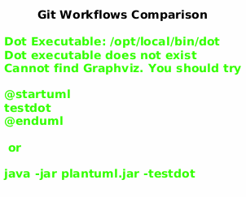

# Git Workflows & Team Flows

This document describes three branching strategies for PlantUML Entity Kit development.

## Overview



| Flow | Automation | Team Size | Best For |
|------|------------|-----------|----------|
| **Agentic Git Flows** | 100% | Any | AI-driven continuous deployment |
| **Agentic Team Flow** | 80% | 3-10 | Human + AI collaboration |
| **Simplified GitFlow** | Manual | 2-5 | Small teams, fixed release cycles |

---

## 1. Agentic Git Flows

Designed for AI agents to autonomously manage feature development, testing, and release workflows.

### Key Features

- **No feature freeze** — continuous deployment with feature flags
- **Automatic testing** — agents verify before merge
- **Self-healing** — agents revert broken merges
- **Audit trail** — all agent actions logged
- **Human override** — critical changes require approval

### Branch Structure

```
main (production)
  └── release/* (release candidates)
        └── feature/* (agent-driven development)
```

### Workflow

1. Agent creates `feature/*` branch from `release/*`
2. Agent implements changes, runs tests
3. Agent creates PR with auto-generated description
4. CI validates, agent reviews test results
5. Agent merges on green, or reverts on failure
6. Release branch promotes to main on schedule

---

## 2. Agentic Team Flow

Hybrid workflow: humans decide, agents execute.

### Key Features

- **Human oversight** — all merges require human approval
- **Agent assistance** — automated testing, linting, security scans
- **Communication** — Slack/Discord notifications, GitHub comments
- **Weekly summaries** — automated progress reports

### Workflow

```
┌─────────────┐     ┌─────────────┐     ┌─────────────┐
│   Human     │────>│   Agent     │────>│   Human     │
│ Creates PR  │     │ Runs Checks │     │  Approves   │
└─────────────┘     └─────────────┘     └─────────────┘
                           │
                           v
                    ┌─────────────┐     ┌─────────────┐
                    │   Agent     │────>│   Agent     │
                    │   Merges    │     │  Deploys    │
                    └─────────────┘     └─────────────┘
```

### Steps

1. Human creates PR with description
2. Agent runs: tests, lint, build, security checks
3. Human reviews and approves
4. Agent merges and updates release notes
5. Team Lead triggers release
6. Agent tags and deploys

---

## 3. Simplified GitFlow

Lightweight flow for small teams (2-5 people).

### Branch Structure

| Branch | Purpose | Lifetime |
|--------|---------|----------|
| `main` | Production-ready code (tagged) | Permanent |
| `develop` | Integration branch | Permanent |
| `feature/*` | Feature development | Temporary |
| `release/*` | Release preparation | Temporary |
| `hotfix/*` | Production fixes | Temporary |

### Workflow Example

```bash
# Create feature branch
git checkout -b feature/add-login develop

# Make changes and commit
git add .
git commit -m "Add login feature"

# Push and create PR
git push -u origin feature/add-login

# After approval, merge to develop
git checkout develop
git merge --no-ff feature/add-login
git branch -d feature/add-login
```

### Advantages

- Simple to understand
- Works well for small teams (2-5)
- Produces stable releases
- Clear separation of concerns
- Minimal tooling required

---

## Comparison Matrix

| Aspect | Agentic | Team | Simple |
|--------|---------|------|--------|
| **Automation** | 100% | 80% | 0% |
| **Team Size** | Any | 3-10 | 2-5 |
| **Release Cadence** | Continuous | Weekly | Monthly |
| **Complexity** | High | Medium | Low |
| **Learning Curve** | Steep | Moderate | Easy |
| **CI/CD Required** | Yes | Yes | No |
| **Human Oversight** | Minimal | Moderate | High |

---

## Choosing Your Flow

### Use Agentic Git Flows when:
- Building AI-first development pipelines
- Need continuous deployment with minimal intervention
- Have robust testing infrastructure
- Trust automated decision-making

### Use Agentic Team Flow when:
- Want AI assistance with human control
- Weekly release cycles work for your team
- Need audit trails and approval workflows
- Balancing speed with oversight

### Use Simplified GitFlow when:
- Small team (2-5 developers)
- Monthly or scheduled releases
- Simple projects without complex CI/CD
- Team prefers manual control

---

## PlantUML Source

See [uml/git-flows.puml](uml/git-flows.puml) for the diagram source.

---

**Last Updated:** 2026-01-27
**Status:** Approved for PlantUML Entity Kit team
