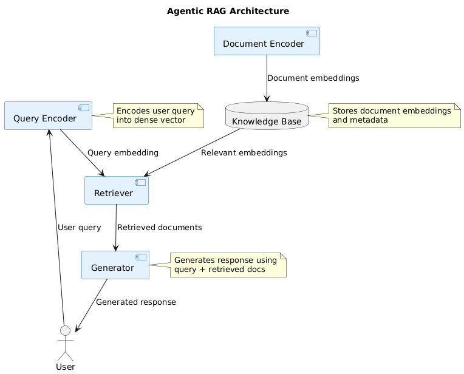

# Agentic RAG Reference Architecture

The Agentic Retrieval Augmented Generation (RAG) is an AI model that combines a retrieval system with a language model to generate coherent and relevant responses based on retrieved knowledge. This reference architecture outlines the key components and their interactions within an Agentic RAG system.

## Components and Interactions

The primary components in an Agentic RAG include the `Query Encoder`, `Document Encoder`, `Retriever`, `Generator`, and `Knowledge Base`. Here's a simplified diagram representing these components and their interactions:

```plantuml
@startuml

!define component(x) component x << (C,#FFAAAA) >>

component(QueryEncoder) {
  Encodes user query
  into query embedding
}

component(DocumentEncoder) {
  Encodes documents
  into document embeddings
}

database KnowledgeBase {
  Stores document embeddings
  and associated metadata
}

component(Retriever) {
  Retrieves relevant documents
  based on query embedding
}

component(Generator) {
  Generates response
  based on query and retrieved documents
}

QueryEncoder -> Retriever : Query embedding
DocumentEncoder -> KnowledgeBase : Document embeddings
KnowledgeBase -> Retriever : Relevant document embeddings
Retriever -> Generator : Retrieved documents
Generator -> User : Generated response

@enduml
```



## Component Descriptions

- Query Encoder: Encodes the user's query into a dense vector representation (query embedding) using a pre-trained language model.

- Document Encoder: Encodes the documents in the knowledge base into dense vector representations (document embeddings) using a pre-trained language model.

- Knowledge Base: Stores the document embeddings along with associated metadata such as document IDs, titles, and content.

- Retriever: Retrieves the most relevant documents from the knowledge base based on the similarity between the query embedding and document embeddings.

- Generator: Generates a coherent and relevant response based on the user's query and the retrieved documents using a pre-trained language model fine-tuned for the specific task.

## Interaction Flow

1. The user provides a query to the Agentic RAG system.
2. The Query Encoder encodes the user's query into a query embedding.
3. The Retriever uses the query embedding to search for the most relevant documents in the Knowledge Base based on the similarity between the query embedding and document embeddings.
4. The Retriever returns the retrieved documents to the Generator.
5. The Generator takes the user's query and the retrieved documents as input and generates a coherent and relevant response.
6. The generated response is returned to the user.

The Document Encoder is used offline to pre-process and encode the documents in the knowledge base, generating the document embeddings that are stored along with the associated metadata.

This Agentic RAG architecture enables the system to leverage external knowledge from the knowledge base to generate informative and contextually relevant responses to user queries. The retrieval component allows the model to access relevant information, while the generation component ensures the coherence and fluency of the generated response.


