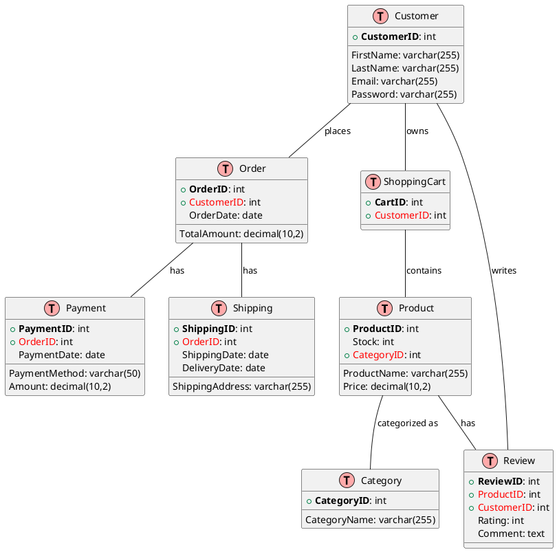
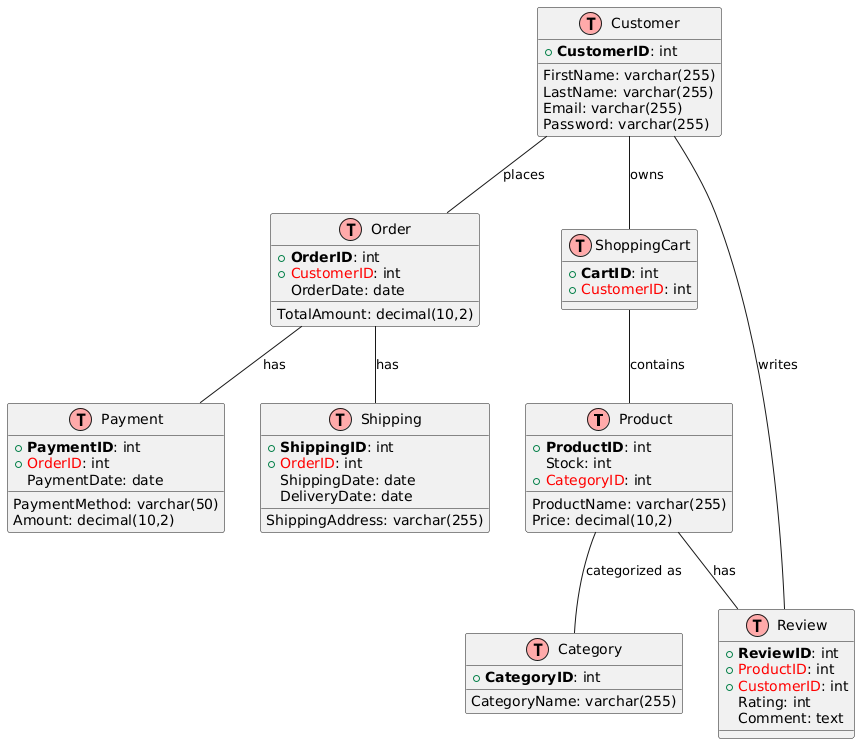

# E-Commerce System Reference Architecture

The E-Commerce system is a quintessential online retail platform that facilitates the buying and selling of products. This reference architecture demonstrates key aspects such as inventory management, online transactions, user authentication, and digital marketing.

## Entities and Relationships

The primary entities in this system include `Product`, `Customer`, `Order`, `Shopping Cart`, `Payment`, `Shipping`, `Category`, and `Review`. Here's a simplified ER diagram representing these entities and their relationships:

## Entity Descriptions

- Product: Represents the items available for purchase, associated with categories and reviews.
- Customer: Represents the users of the platform with their essential information.
- Order: Captures the details of customer orders.
Shopping Cart: Holds products that a customer intends to purchase.
- Payment: Records payment transactions for orders.
- Shipping: Manages shipping information for orders.
- Category: Classifies products into various categories.
- Review: Holds customer reviews for products.

## Relationship Descriptions
- A Product is categorized under a Category and can have multiple Reviews.
- A Customer can own a Shopping Cart, place multiple Orders, and write multiple Reviews.
- An Order is associated with a Payment and Shipping detail.
- A Shopping Cart can contain multiple Products.

This simplified E-Commerce model serves as a basis for understanding the relationships and interactions within an online retail system. It can be further expanded or modified to meet the specific needs of different E-Commerce platforms.

